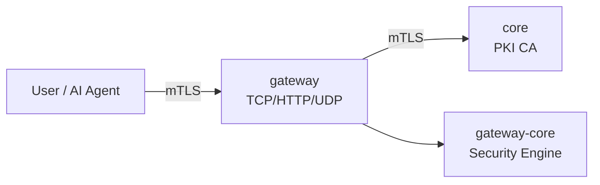

# varwof-gateway

> Three-layer zero-trust security gateway — TCP/HTTP/UDP with mTLS mutual authentication + fine-grained RBAC + AIC capability verification.

[](LICENSE)
[](https://pkg.go.dev/github.com/varwof/gateway)

[中文](README_CN.md)

## What is varwof-gateway?

Three-layer zero-trust security gateway integrating TCP/HTTP/UDP protocols with mTLS mutual authentication and fine-grained access control.

## Quick Start

```bash
go build -o gateway .

cat > config.json <<EOF
{
  "listeners": [{
    "name": "https",
    "listen": ":443",
    "protocol": "http2",
    "tls": {
      "mode": "mtls",
      "cert_file": "server.pem",
      "key_file": "server-key.pem",
      "ca_cert_file": "ca.pem"
    },
    "routes": [
      { "path": "/", "target": "http://127.0.0.1:8080" }
    ]
  }]
}
EOF

gateway --config config.json
```

## Installation

```bash
go build -o gateway .
```

## Features

| Layer | Protocol | Capabilities |
|-------|----------|-------------|
| **L4** | TCP | Transparent proxy + mTLS |
| **L7** | HTTP | Reverse proxy + path-level RBAC |
| **L3** | UDP | DTLS/QUIC + rate limiting |

Common: CRL/OCSP real-time revocation, AIC capability verification, structured logging (slog), Prometheus metrics, hot reload (SIGHUP), management API.

## Ecosystem



gateway is the **frontend access layer** of the varwof ecosystem. This project is a member of the [Open Invention Network](https://openinventionnetwork.com/).

## Links

| | |
|---|---|
| Homepage | https://varwof.com |
| Community | https://varwof.org |
| IETF Draft | [draft-wei-aic-identity-cert](https://datatracker.ietf.org/doc/draft-wei-aic-identity-cert/) |
| License | Apache-2.0 |
| Member | [Open Invention Network](https://openinventionnetwork.com/) |
